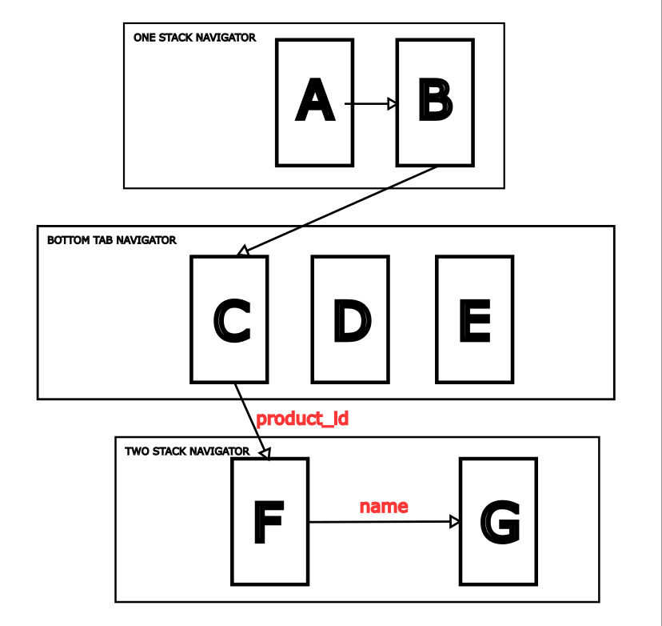
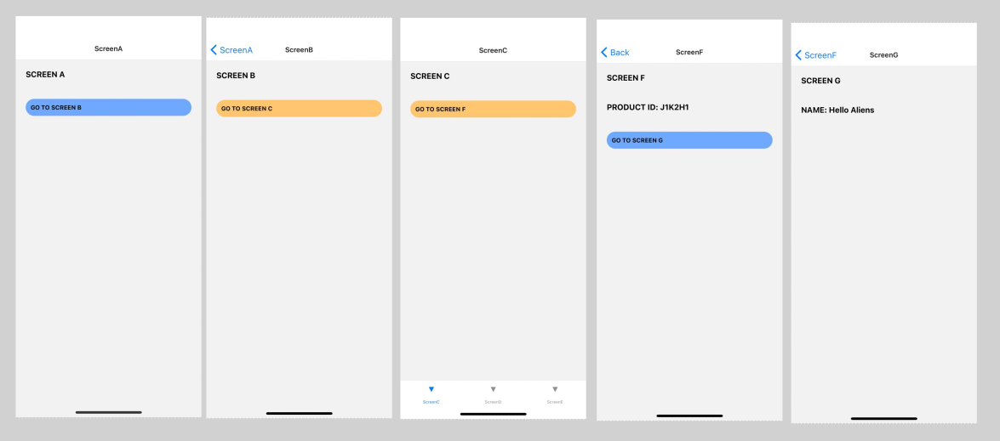

# Reactnavigator-tutorial

Tutorial of React Native Navigator App
Link Course: [YoutubeChannel](https://www.youtube.com/channel/UCL5Jmmz0wTxlrn6jzOpLl6A)

## Architecture

## Screens 

## Setting up

 1. Download/Clone Project
 2. execute **npm i**
 3. **expo start**
 

# Commands Used

Create project and install dependencies

    expo init proyecto
    
    npm i @react-navigation/stack

    npm i @react-navigation/bottom-tabs

    npm i @react-navigation/native

